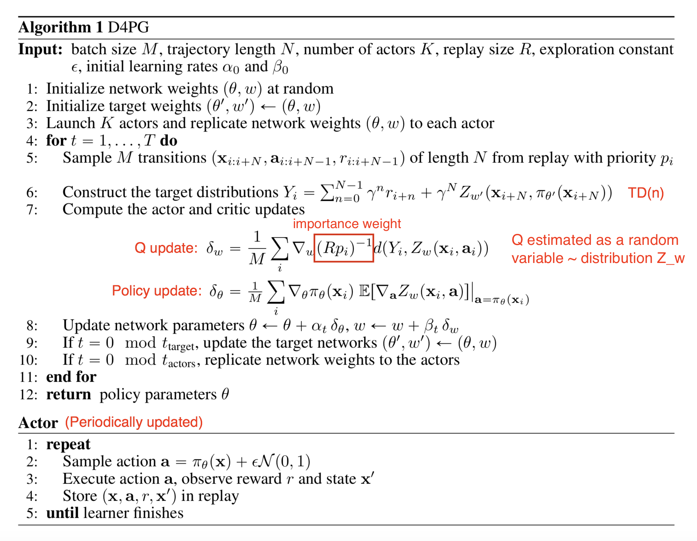
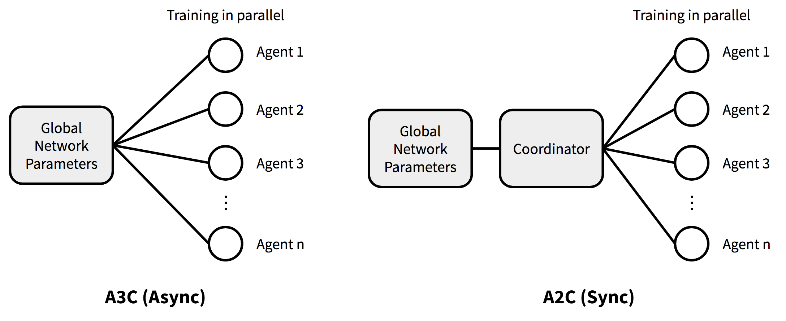

# Report Project 2 - Continuous Control

## Part I - Theory

### Deep Deterministic Policy Gradient - DDPG

The first unsuccessful attempt training one single agent uses a model based on the DDPG (Deep Deterministic Policy Gradient) algorithm introduced in the paper [Continuous control with deep reinforcement learning](https://arxiv.org/abs/1509.02971). A brief description of the algorithm following the notation established in Project 1 follows.

Again the formal framework of a __Markov Decision Process__  (MDP) is used with

* a __state space__ $\mathbb{S}$ of states $S_t$
* an __action space__ $\mathbb{A}$ with $A_t \in \mathbb{R}^N$ 
* __transition dynamics__ $\mathbb{P}(S_{t+1}|S_t, A_t)$ that define the distribution of states that the agent can land on taking an action $A_t \in \mathbb{R}^N$ in state $S_t$, with initial state distribution $\mathbb{P}(S_1)$
* a __reward function__ $R(S_t, A_t)$

An agent's behavior is defined by a policy, $\pi$, which maps states to a probability distribution over the actions $\pi: \mathbb{S} \to \mathbb{P}(\mathbb{A})$. The return from a state is defined as the sum of discounted future reward $R_t = \sum_{i=t}^T \gamma^{(i-t)}R(s_i, a_i)$ with a discounting factor $\gamma \in [0, 1]$.

The goal of reinforcement learning is to learn a policy which maximizes the expected return from the start distribution $J=\mathbb{E}_\pi(R_1)$. The discounted state visitation distribution for a policy $\pi$ is denoted with $\rho^\pi$.

The action-value function describes the expected return after taking an action $A_t$ in state $S_t$ and thereafter following policy $\pi$:
$$
Q^{\pi}(S_t, A_t)=\mathbb{E}_\pi(R_t|S_t,A_t)
$$
The bedrock of many reinforcement learning algorithms is the Bellman equation which is given by 
$$
Q^\pi(S_t, A_t)=\mathbb{E}(R(S_t, A_t)+\gamma\mathbb{E}_\pi(Q^\pi(S_{t+1},A_{t+1}))).
$$
If the target policy is deterministic it can be described as a function $\mu: \mathbb{S}\leftarrow\mathbb{A}$ and the inner expectation can be avoided:
$$
Q^\mu(S_t, A_t)=\mathbb{E}(R(S_t, A_t)+\gamma Q^\mu(S_{t+1},A_{t+1})).
$$
Given that the remaining expectation depends only on the environment and not on the policy, it is possible to learn $Q^\mu$ off-policy, using transitions which are generated from a different stochastic behavior policy $\beta$.

Q-Learning, which is an off-policy algorithm, uses the greedy policy $\mu(s)=\text{argmax}_a Q(s,a)$. Function approximators parameterized by $\theta^Q$ are used, which are optimized by minimizing the loss:
$$
L(\theta^Q)=\mathbb{E}\left(\left(Q(S_t, A_t|\theta^Q)-Y_t\right)^2\right)
$$
where
$$
Y_t = R(S_t,A_t)+\gamma Q(S_{t+1}, \mu(S_{t+1})|\theta^Q)
$$
While $Y_t$ is also dependent on $\theta^Q$, this is typically ignored.

Using non-linear function approximators with a large number of parameters for learning action-value functions has previously been avoided as theoretical performance guarantees are impossible and practically learning is unstable. Q-Learning became usable in practice with the introduction of two major changes:

* the use of a __replay buffer__ and
* a separate __target network__ for calculating $Y_t$

In continuous action spaces $\mathbb{A}$ it is not straightforward to apply Q-Learning, because finding the greedy policy in each timestep requires evaluating an optimization problem, which is too slow to be practical with large, unconstrained function approximators and large action spaces.

Instead DDPG builds on the actor-critic approach introduced by the DPG algorithm introduced in [Deterministic Policy Gradient Algorithms](http://proceedings.mlr.press/v32/silver14.pdf).

The DPG algorithm maintains a parameterized actor function $\mu(s|\theta^\mu)$ which specifies the current policy by deterministically mapping states to a specific action. The critic $Q(S,A)$ is learned using the Bellman equation as in Q-Learning. The actor is updated by applying the chain rule to the expected return from the start distribution $J$ with respect to the actor parameters:
$$
\begin{align}
\nabla_{\theta^\mu}J &\approx \mathbb{E}_{\rho^\beta}(\nabla_{\theta^\mu}Q(S,A|\theta^Q)|_{S=s_t,A=\mu(s_t|\theta^\mu)}) \\
&=\mathbb{E}_{\rho^\beta}(\nabla_A Q(S,A|\theta^Q)|_{S=s_t,A=\mu(s_t)}\nabla_{\theta_{\mu}}\mu(s|\theta^\mu)|_{S=s_t})
\end{align}
$$
This is the policy gradient, the gradient of the policy's performance.

The first major change to the application of neural networks to DPG previously mentioned is the use of a __replay buffer__. The replay buffer is a finite sized cache $\mathcal{R}$. Transitions are sampled from the environment according to the exploration policy and the tuple $(S_t, A_t, R_t,S_{t+1})$ is stored in the replay buffer. When replay buffer is full the oldest samples are discarded. At each timestep the actor and the critic are updated by sampling a minibatch uniformly from the buffer. Because DDPG is an off-policy algorithm, the replay buffer can be large, allowing the algorithm to benefit from learning a set of uncorrelated transitions.

Additionally, a __target network__ is deployed by using soft target updates, rather than directly copying the weights. A copy of the actor and critic networks $Q'(S,A|\theta^{Q'})$ and $\mu'(s|\theta^{\mu'})$ that is used for calculating the target values. The weights of these target networks is then updated by having them slowly track the learned networks: $\theta' \leftarrow \tau \theta +(1-\tau)\theta'$ with $\tau \ll 1$. Thus, the target values are constrained to change slowly, greatly improving the stability of the learning.

In order to do better exploration, an exploration policy $\mu'$ is constructed by adding a noise process $\mathcal{N}$ to the actor policy:
$$
\mu'(s_t)=\mu(s_t|\theta^\mu_t)+\mathcal{N}
$$

### Distributed Distributional Deep Deterministic Policy Gradients - D4PG

__Distributed Distributional DDPG__ applies a set of improvements on DDPG to make it run in a distributional fashion.

1. __Distributional Critic__: The critic estimates the expected $Q$ value as a random variable, a distribution $Z_w$ parameterized by $w$ and therefore $Q_w(S,A)=\mathbb{E}(Z_w(S,A))$. The loss that is to be minimized for learning the distribution parameter is constructed through some measure $d$ of the distance between two distributions, the distributional TD error $L(w)=\mathbb{E}(d(\mathcal{T}_{\pi_{\theta}},Z_w'(S,A), Z_w(S,A)))$ , where $\mathcal{T}_{\mu_{\theta}}$ is the Bellman operator. The deterministic policy gradient update becomes:
   $$
   \begin{align}
   \nabla_{\theta^\mu}J &\approx \mathbb{E}_{\rho^\beta}(\nabla_A Q_w(S,A|\theta^Q)|_{S=s_t,A=\mu(s_t)}\nabla_{\theta_{\mu}}\mu(s|\theta^\mu)|_{S=s_t}) \\
   &=\mathbb{E}_{\rho^\beta}(\mathbb{E}(\nabla_A Z_w(S,A|\theta^Q)|_{S=s_t,A=\mu(s_t)})\nabla_{\theta_{\mu}}\mu(s|\theta^\mu)|_{S=s_t})
   \end{align}
   $$

2. 

2. __N-step returns__: When calculating the TD error, D4PG computes the N-step TD target rather than the one-step TD target to incorporate rewards of more future steps.
3. __Multiple Distributed Parallel Actors__: D4PG utilizes $K$ independent actors, gathering experience in parallel and feeding data into the same replay buffer.
4. __Prioritized Experience Replay__: The last modification is to do sampling from the replay buffer of size $R$ with a non-uniform probability $p_i$. This way, a sample $i$ has the probability $(Rp_i)^{-1}$ to be selected, which is the importance weight.

### Asynchronous Advantage Actor-Critic - A3C

__A3C__ is a classical policy gradient method with a special focus on parallel training. In A3C, the critics learn the value function while multiple actors are trained in parallel and get synchronized with global parameters from time to time. A3C is designed to work well for parallel training.

Taking the state-value function as an example, the loss function for the state value is to minimize the mean squared error $J_v(w)=(G_t-V_w(S))^2$. Gradient descent can be applied to find the optimal $w$. This state-value function is used as the baseline in the policy gradient update.

The outline of the algorithms follows:

1. There are global parameters $\theta$ and $w$ and similarly thread-specific parameters $\theta'$ and $w'$.

2. Initialize $t=1$.

3. While $T \leq T_{\max}$:

   1. Reset the gradient by setting $d\theta=0$ and $dw=0$.

   2. Synchronize the thread-specific parameters with the global ones $\theta'=\theta$ and $w'=w$.

   3. Set $t_{\text{start}}=t$ and sample a starting state $s_t$.

   4. While $s_t$ is not in the terminal state and $t-t_{\text{start}}\leq t_{\max}$:

      1. Pick the action $A_t \sim \pi_{\theta'}(A_t|S_t)$ and receive a new reward $R_t$ and a new state $S_{t+1}$.
      2. Update $t=t+1$ and $T=T+1$.

   5. Initialize the variable that holds the return estimation
      $$
      R=\begin{cases}
      0 
         &\text{if} \,\, S_t \,\, \text{is} \,\, \text{terminal} \\[1ex]
      V_{w'}(S_t) &\text{otherwise}
      \end{cases}
      $$

   6. For $i=t-1,\dots,t_{\text{start}}$:

      1. $R \leftarrow \gamma R + R_{i}$, where $R$ is a MC measure of $G_{i}$
      2. Accumulate gradients with respect to $\theta': d\theta \leftarrow d\theta + \nabla_{\theta'} \log \pi_{\theta'}(A_i,S_i)(R-V_{w'}(S_i))$
      3. Accumulate gradients with respect to $w'$: $dw\leftarrow dw + 2(R-V_{w'}(s_i))\nabla_{w'}(R-V_{w'}(S_i))$

   7. Update asynchronously $\theta$ using $d\theta$ and $w$ using $dw$.

A3C enables parallelism in multiple agent training. The gradient accumulation step can be understood as a parallelized version of the minibatch-based stochastic gradient update: the values $w$ and $\theta$ get corrected by a little bit in the direction of each training thread independently.

### Advantage Actor-Critic - A2C

A2C is a synchronous, deterministic version of A3C. In A3C each agent talks to the global parameters independently, so it is sometimes possible that the thread-specific agents would by processing with different policies and thus the aggregated update would not be optimal. To resolve this problem, a coordinator in A2C waits for all the parallel actors to finish their work before updating the global parameters and then in the next iteration parallel actors start from the same policy. The synchronized gradient update keeps the training more cohesive and makes convergence potentially faster.

A2C has been shown to utilize GPUs more efficiently and work better with large batch sizes while achieving same or better performance than A3C.

## Part II - Practice

In this project, the three model types described in Part I were applied; DDPG and D4PG on the environment with the single agent and A2C on the environment with the 20 agents. 

For the environment with the single agent, DDPG and D4PG are appropriate as the sequence of experiences will be highly correlated and thus the replay buffer employed by both models is useful to break these correlations.

While DDPG with the applied configuration does not seem to learn effectively in the single agent environment, the successor method D4PG successfully learns the task, albeit slowly.

### Deep Deterministic Policy Gradient - DDPG

The code is to a large part based [on the template provided by Udacity](https://github.com/udacity/deep-reinforcement-learning/tree/master/ddpg-pendulum), which in turn implements the methodology described in the [paper introducing DDPG](https://arxiv.org/abs/1509.02971). The weights of both networks employ Xavier initialization.

The actor and the critic network both consist of two hidden layers of size 128 and 64 respectively and the learning rate is set to 0.0001 for both networks. 

##### Hyperparameters

- Learning Rate (Actor/Critic): 1e-4
- Weight Decay: 1e-2
- Batch Size: 64
- Buffer Size: 100000
- Gamma: 0.99
- Tau: 1e-3
- Learning per timestep: 20
- Max Gradient Clipped for Critic: 1
- Hidden Layer 1 Size: 128
- Hidden Layer 2 Size: 64

### Distributed Distributional Deep Deterministic Policy Gradients - D4PG

 The code is largely derived from the code coming with the book [Deep Reinforcement Learning Hands-On]( https://github.com/PacktPublishing/Deep-Reinforcement-Learning-Hands-On), which in turn is based on the methodology described in the [paper introducing D4PG](https://arxiv.org/abs/1804.08617). The only significant change is that the critic network has N_ATOMS outputs. Although the algorithm does accommodate multiple transition trajectory (N-steps), a one-step transition model is chosen instead. There are again two hidden layers of size 128 and 64. Instead of the Ornstein-Uhlenbeck process used for exploration in DDPG, in this case a white noise process is used. 

##### Hyperparameters

- Learning Rate (Actor/Critic): 1e-4
- Batch Size: 64
- Buffer Size: 100000
- Gamma: 0.99
- Tau: 1e-3
- Repeated Learning per time: 10
- Learning per timestep: 150
- Max Gradient Clipped for Critic: 1
- N-step: 1
- N-Atoms: 51
- Vmax: 10
- Vmin: -10
- Hidden Layer 1 Size: 128
- Hidden Layer 2 Size: 64

 

### Advantage Actor-Critic - A2C

For the environment with the 20 agents, A2C is an appropriate model as its structure has been shown to work well in environments where parallel batch processing is feasible. The layer structure is again a fully connected 128 unit - 64 unit structure and the actions are sampled from a normal distribution with mean $\mu$ and standard deviation $\sigma$ that are dependent on the state. The resulting sampled value is passed through a tanh activation function so that the value is mapped into the interval $[-1, 1]$.

##### Hyperparameters

- Number of learning episode: 1000
- Number of N-Step: 10
- Learning rate: 0.00015
- Gamma: 0.99

  

### Model Comparison

Obviously the single agent models need more episodes to learn, with the DDPG actually never being able to pick up any structural behaviour within the given episode limit. Compared to the single agent D4PG model, the multi agent A2C model clearly learns much faster.

## Part III - Improvements

* **N-step returns for D4PG**: Use N-step returns instead of the actually deployed one-step returns. This usually increases the stability of the algorithm.
* __Parallel Processing__: Employ parallel processing for the straightforwardly parallelizable parts of the code.